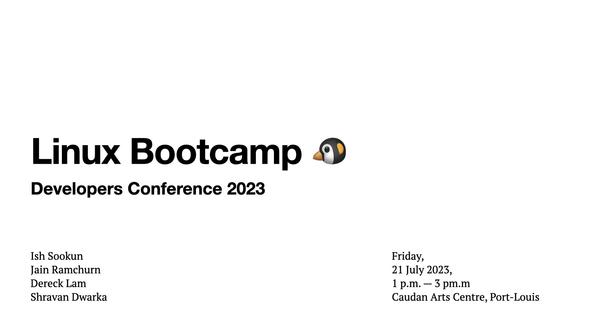

# Developers Conference 2023 - Linux Bootcamp

An intense 2-hours Linux bootcamp fully packed with information essential to boosting one's career as a Linux System Administrator by Ish Sookun.

Demos will be carried on openSUSE and Ubuntu virtual machines.

Bootcamp volunteers: Jain Ramchurn, Dereck Lam and Shravan Dwarka. 

## Credits

- Cover and Agenda Slides from [Ish Sookun](https://github.com/ishwon).
